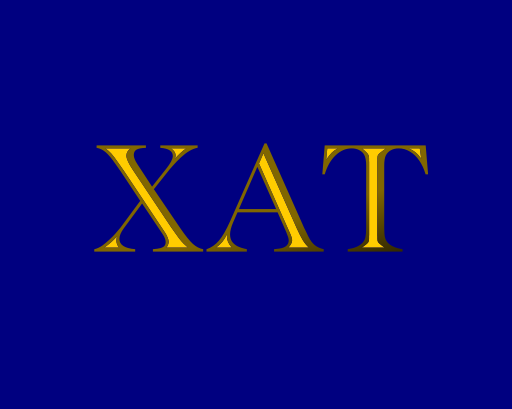

# xat



Asset bookkeeping algorithm for Finnish cryptocurrency taxation.

### Features:

- Double-entry accounting
- High-precision decimal representation of financial numbers ([big.js](https://github.com/mikemcl/big.js/))
- Maintain account-level FIFO-ordering of acquired assets.
- Process transaction journal file into assets, accounts, and tax events.
- Compute account balances at any given time.
- Automatic error detection of negative balance and balance mismatch.
- Configurable error-tolerance of balance mismatch.
- Support checking against known balance.
- Generate annual reports of transactions and balances.
- Realize transaction fees that were charged in crypto.
- Carry transaction fees into associated sales for tax deduction.
- Uses CoinGecko.com data for default asset price retrieval.
- Comprehensive sanity checks of recorded values and prices.
- Readable error messages that help in correcting the books.
- Configurable run mode: stop after the first error or just skip and continue.


# Installation

```
$ npm install
$ cp config-sample.json config.json
```

Provide your transactions in a `transaction-history.csv`. See `lib/readRows.js` for the expected column labels.

```
$ npm start
```

# Development

Run the test suite:

```
$ npm test
```

# License

GPLv3
